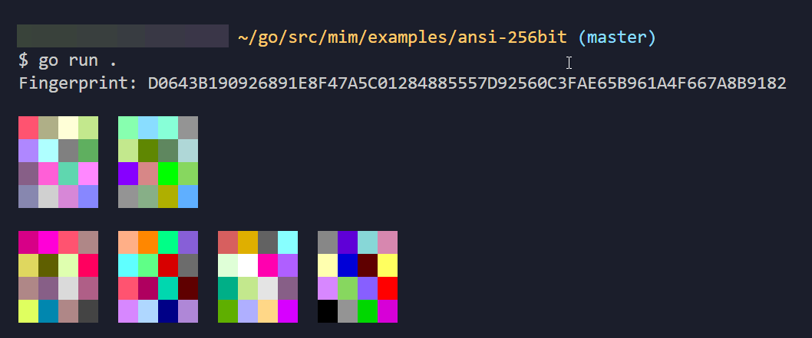

# MIM (Minimal Identity Mozaic)

MIM is a Hash Visualization format utilising 4x4 colour matrixes. This provides a quick and easy method to compare fingerprints, e.g. SSH keys, x509 certs etc.

*Note. MIM may not be appropriate when ANSI colours have been customised, either via the vendor or user on different applications.*

## Properties
- Pre Image Resistant
- Fixed Length Output (either 256bit or 512bit)
- Collision Resistant
- Fast & Efficient

## Output

MIM outputs coloured ANSI escape codes.



## Example

```go
package main

import (
	"crypto/sha256"
	"fmt"

	"github.com/go-compile/mim"
)

func main() {
	fingerprint := sha256.Sum256([]byte("certificate contents would typically go here"))

	fmt.Printf("Fingerprint: %X\n\n", fingerprint)
	
	fmt.Println(mim.New(fingerprint[:], sha256.New).ANSI())
}
```